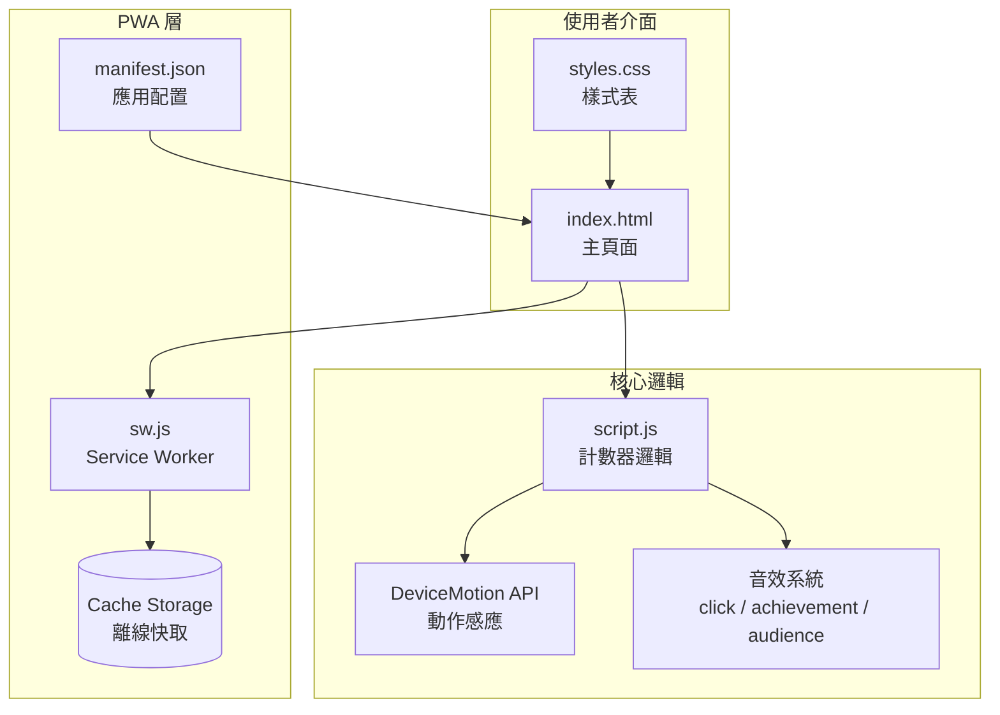
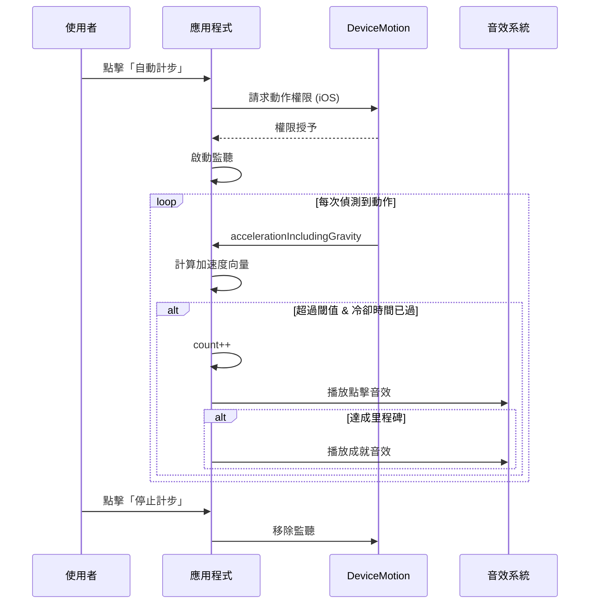

# 日常步數記錄器

[← 回到 Muripo HQ](https://tznthou.github.io/muripo-hq/)

## 專案簡介

一款輕量化的 PWA 步數記錄工具，支援手動計數與自動計步雙模式。

透過裝置動作感應器（DeviceMotion API）實現真實計步功能，搭配音效回饋與里程碑成就系統，讓日常步數追蹤更有趣。可安裝至手機主畫面，離線也能使用。

## 功能特色

| 功能 | 說明 |
|------|------|
| 手動計數 | 透過 +/- 按鈕手動增減數字，支援重置歸零 |
| 自動計步 | 利用 DeviceMotion API 偵測行走動作，自動累加步數 |
| 音效回饋 | 點擊音效、成就音效、重置音效，提升互動體驗 |
| 里程碑成就 | 達到 10、50、100 步時播放成就音效 |
| PWA 支援 | 可安裝至主畫面、離線使用、獨立應用視窗 |
| 響應式設計 | 適配各種螢幕尺寸，行動裝置優先 |

## 系統架構



## 計步流程



## 專案結構

```
day-03-counter/
├── index.html          # 主頁面 (UI 結構)
├── styles.css          # 樣式表 (CSS 變數、響應式)
├── script.js           # 核心邏輯 (計數、計步演算法)
├── sw.js               # Service Worker (離線快取)
├── manifest.json       # PWA 配置檔
├── icon-192.png        # 應用圖示 192×192
├── icon-512.png        # 應用圖示 512×512
├── media/
│   ├── click.mp3       # 點擊音效
│   ├── achievement.mp3 # 成就音效
│   └── audience.mp3    # 重置音效
└── README.md
```

## 技術細節

### 計步演算法

```javascript
// 計算三軸加速度的向量長度
magnitude = √(x² + y² + z²)

// 判斷條件
if (magnitude > threshold && timeSinceLastStep > cooldown) {
    recordStep()
}
```

- **閾值 (threshold)**: 4 (中等敏感度)
- **冷卻時間 (cooldown)**: 300ms (避免重複計數)
- **節流間隔**: 50ms (降低 CPU 負載)

### PWA 快取策略

採用 **Cache First** 策略：
1. 優先從快取讀取資源
2. 快取未命中時才發送網路請求
3. 版本更新時自動清除舊快取

## 技術棧

- **前端**: HTML5 / CSS3 / Vanilla JavaScript
- **PWA**: Service Worker + Web App Manifest
- **感應器**: DeviceMotion API
- **圖示**: Font Awesome 6.x
- **字型**: Inter (Google Fonts)
